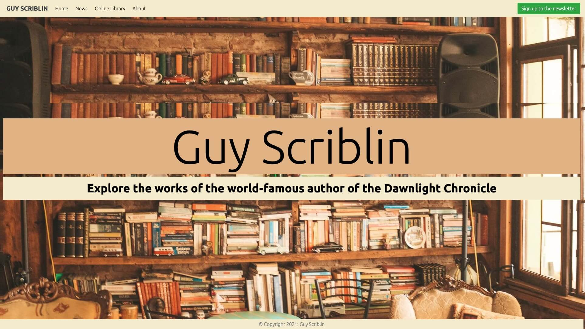
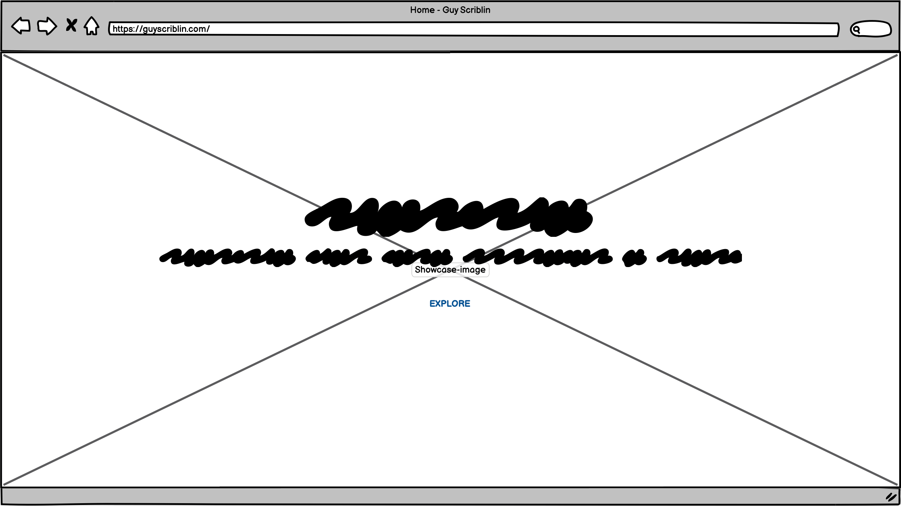
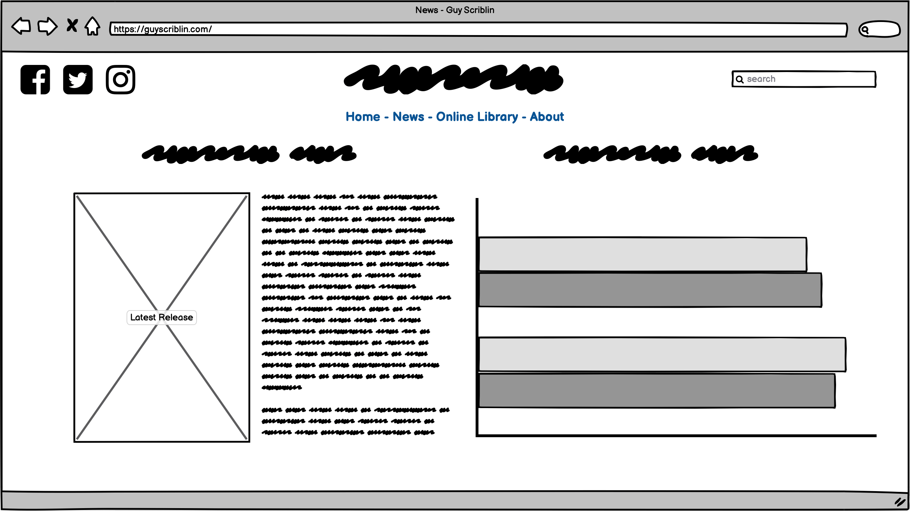
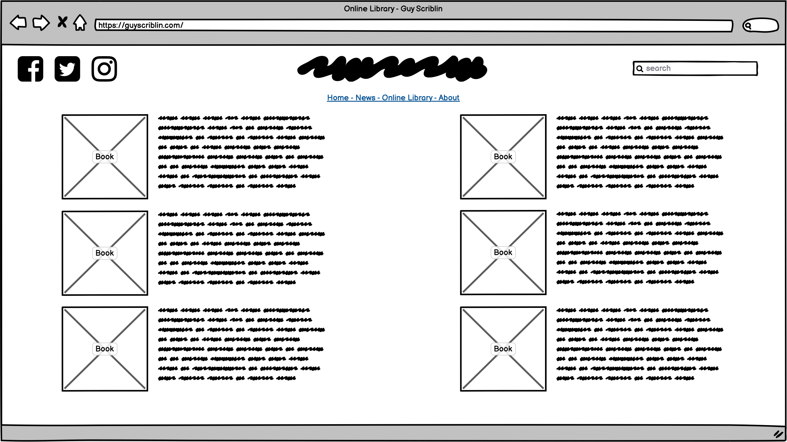
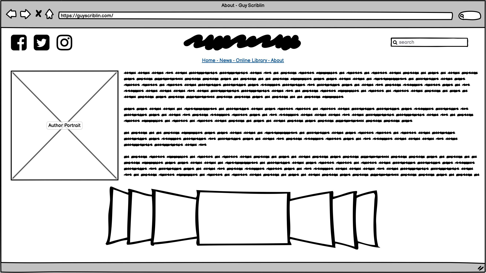
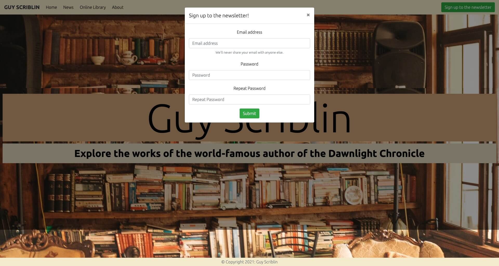
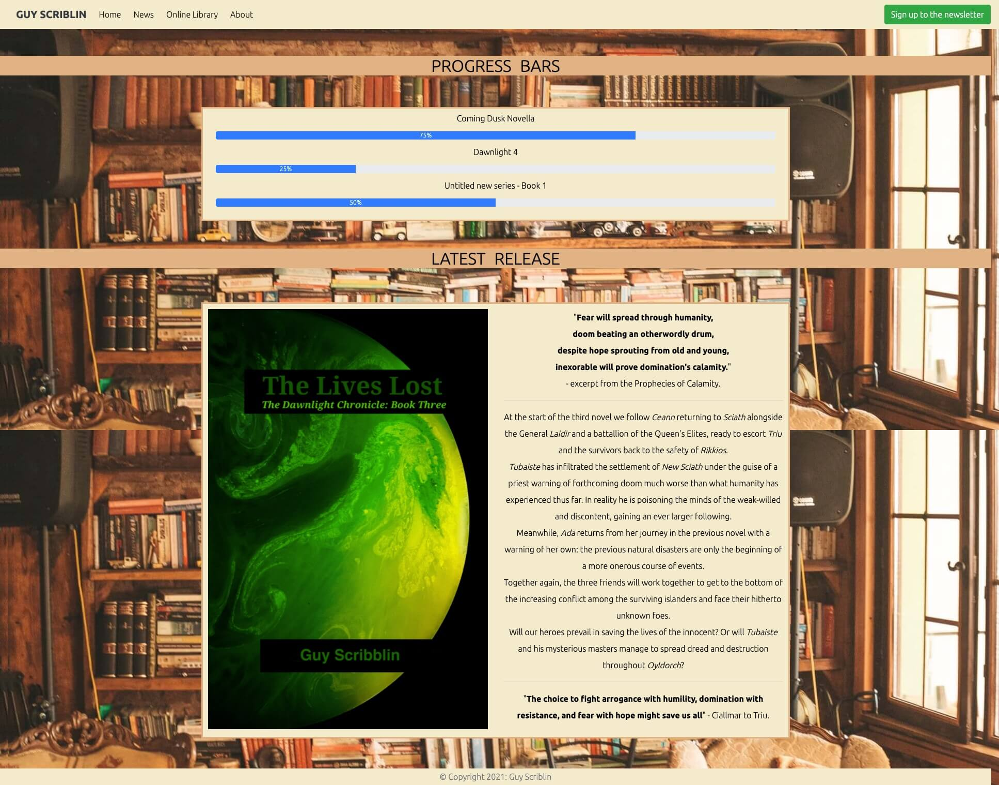
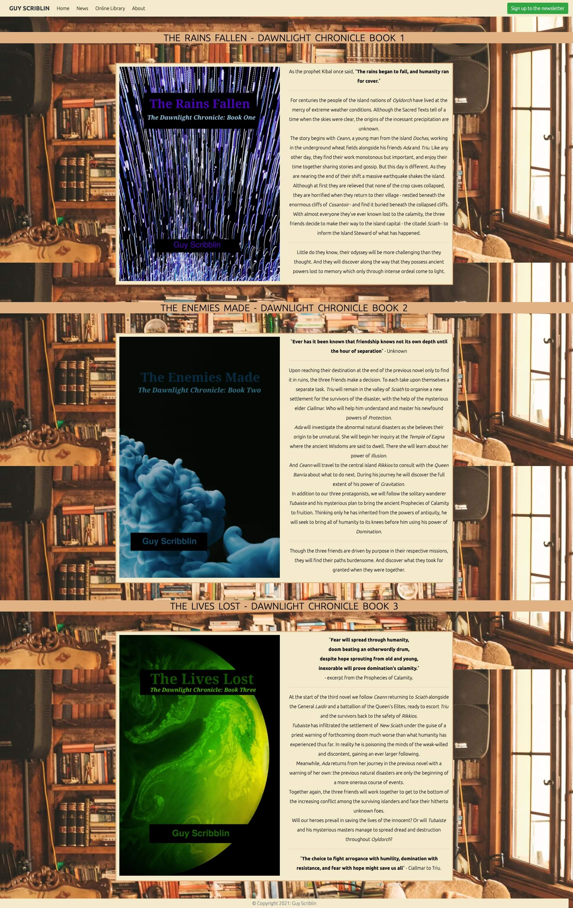
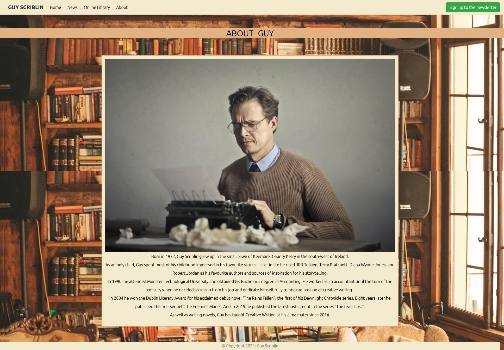

# Milestone Project 1 - Author Website

[View the live project here](https://pablo1793.github.io/mp1-author_website/)

This is the README.md file for my first webpage, created for my User Centric Frontend Development Milestone Project submission. It is a website for a fictional author named Guy Scriblin. It is designed to be responsive and accesible on a range of devices, making it easy to navigate for existing and potential readers alike.

The author and owner of this project is Pablo Page, who is happy with the end result despite the odd flaw.

# Technologies Used

## Languages Used

- HTML5
- CSS3

## Frameworks, Libraries & Programs Used

1. Bootstrap 4.5.3:
      - Bootstrap was used to assist with the responsiveness and styling of the website.
2. Hover.css:
      - Hover.css was used on the navbar links to enlarge the font-size of said links when hovered over with the cursor.
3. Google Fonts:
      - Google Fonts were used to import the "Ubuntu" font into the style.css file which is used on all pages throughout the project.
4. jQuery:
      - jQuery came with Bootstrap to make the navbar responsive on mobile devices.
5. Git:
      - Git was used for version control by utilizing the Gitpod terminal to commit to Git and push to Github.
6. GitHub:
      - GitHub is used to store the project's code after being push from Git. It also serves as a platform to deploy, clone, and share the project.
7. Gimp 2.10:
      - Gimp was used to create the images of the fictional book covers used in the website.
8. Pexels
      - Pexels was used to source the author portrait for the About page and the background image that features throughout.
9. TinyPNG
      - TinyPNG.com was used to minify all images used on the site to reduce the website's loading time and minimise the user's data usage if not relying
      on a wifi connection.       
10. Balsamiq:
      - Balsamiq was used before beginning to code to create wireframes which served as reference for the design of the website. Although these wireframes 
      do not reflect the final site design exactly, they served as a useful foundation to build on. You can view images of these initial wireframes below.

# Functionality

## Non-technical

The initial page - or landing page - you will see when visiting the website is little more than a decorated greeting for the user. Containing a title, which is the
author's name, and a subtitle inviting you to explore the website. The background image serves as the backdrop for all pages throughout the site.

At the top of the page is the navbar, which can be found on all pages throughout the website, and remains fixed to the top even when scrolling downwards. It contains six links: one logo -
which is the author's name - that will return you to the landing page if clicked. The first of the four navlinks - Home - shares the same function. The other three navlinks;
News, Online Library, and About, will direct you to the various pages that make up the rest of the website. The final element in the navbar is a button on the right-hand side
labelled "Sign up to the newsletter". When clicked it will open a small, floating window which will request your email address and a password for security purposes.

When visiting the News page you will see two main features. The first a series of progress bars that indicate what projects the author is working on and how close he is to
completing them. The second shows the book cover and synopsis of the author's most recently published novel.

If you click on the Online Library navlink, you can peruse the author's published works. Both book covers and synopses can be viewed and read.

Clicking the final navlink - About - will take you to the author biography page. Here you can view a portrait of the author and read about his life so far.

This is essentially all the functionality available on this site, which you can leaf through on any device. Despite its simple nature, I hope you enjoy browsing it for yourself.

## Technical

This project was written in HTML5 and CSS3. The Bootstrap framework was used for its helpful grid system and the responsive design features it provides. Bootstrap also provided 
the site's only JavaScript feature: which collapses all navlinks into a dropdown button for smaller device sizes. Where they would otherwise clutter the top of the screen.

Although Bootstrap is very useful, original CSS was also written to distinguish the site from a typical website created with the framework. Aspects such as the imagery, font, 
and colour scheme serve this purpose.

At first, the "Sign up to the newsletter" nav element was a simple link. However it was later changed to a button, which opens a modal when clicked. The modal contains a form
which requests the user's email address and password. There is as of yet no backend functionality supporting this sign-up feature.

The contents of the individual pages are organised in rows and columns and contain a small variety of features. Mostly images alonside original text. But also a section on the 
News page containing progress bars. The code for which was taken directly from the Bootstrap documentation, and tweaked somewhat to fit the site's aesthetic.

Finally, at the bottom of all the site's pages there is a simple footer which bookends the design of the website along with the fixed navbar at the top.

# Screenshots

The following are a series of screenshots of the website's final design. Although the background image appears messy in the screen captures, this is due to the extension used to
take the screenshots. When using the website, the background image is set to fixed and no-repeat.

## Landing Page

## Modal

## News Page

## Online Library Page

## About Page

# Installation Instructions

If you want to clone and deploy the project yourself:

1. Go to [my GitHub profile](https://github.com/pablo1793)
2. Click "Repositories" and choose the repo named "<b>mp1-author_website</b>"
3. Click the dropdown labelled "<b>Code</b>"
4. To clone the repository using HTTPS, under "Clone with HTTPS", copy the URL link
5. Open terminal
6. Change the current working directory to the location where you want the cloned directory
7. Type "<i>git clone</i>", and then paste the URL you copied earlier
8. Press <b>Enter</b> to create your local clone

# Testing

