# Guy Scriblin

## Fantasy Novel Author

[View deployed site here](https://pablo1793.github.io/mp1-author_website/)

A comprehensive website for a fantasy author based in the south-west of Ireland. Website features a landing page, a news page containing progress bars that inform of his forthcoming publications and how near they are to being finished, and a section featuring his latest published novel. There is also an online library containing all of the novels published by the author so far, along with their synopses; and an about page informing about the author's biography. Additionally, a form to sign up to the author's monthly email newsletter can be accessed on any page via a button on the navbar.

The primary goal of the website is to engage prior and new readers alike, providing them with information on future projects, published works, and the author himself all in one place.

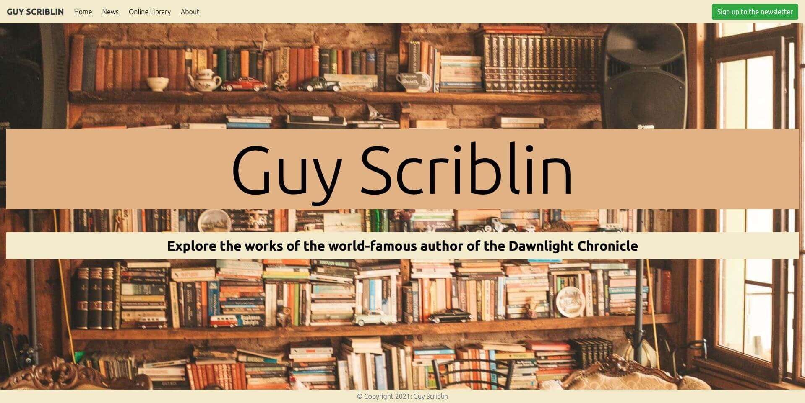

The business goals of this website are:
* Build brand awareness.
* Host an enjoyable space for newcomers and old hats alike.
* Create interest in forthcoming projects.
* Provide images of published novels and brief synopses to capture user's curiosity.
* Ultimately sell more books.

The customer goals of this website are: 
* Following the authors progress on projects they are looking forward to reading upon publication.
* If unfamiliar with the author, getting a good idea of what his books are about.
* Learning more about stories that interest them.

## UX

#### Ideal user

##### The ideal user for this website is:
* English speaking.
* Interested in fiction, specifically Fantasy fiction.
* Is in their late teens or adulthood.
* Is intrigued by the author's works either from prior or newfound interest.

##### Visitors to this website are searching for:
* Information about the author's projects, both published and yet to be published.
* Information about the author himself.

##### This project is the best way to help them achieve these things because:
* It is the author's official website.
* The website provides destails on all published works so far.
* It also provides data of forthcoming projects, which few other author websites do.

##### Client stories:
1. As a new visitor to the website, I want to easily navigate the site and see if I'm interested in the author's work.
2. As a new visitor to the website, I want to browse the author's bibliography to ascertain whether one of his books might be a good present for my son.
3. As a new visitor to the website, I want to learn a bit about the author because I think we went to school together.
4. As a returning visitor to the website, I want to read through the information provided about his published novels. And see whether I missed any details the first time around.
5. As a returning visitor to the website, I want to sign up to the author's newsletter after seeing a video of him online and finding him interesting.
6. As a returning visitor to the website, I want to keep up to date with the author's progress on forthcoming projects. Which I'm looking forward to reading.
7. As a potential customer, I want to buy the author's first book which was recommended to me. But I am disappointed to find the site doesn't yet have a shop.

## Technologies Used

### Languages Used

* HTML5
* CSS3

### Frameworks, Libraries & Programs Used

1. Bootstrap 4.5.3:
      - Bootstrap was used to assist with the responsiveness and styling of the website.
2. Hover.css:
      - Hover.css was used on the navbar links to enlarge the font-size of said links when hovered over with the cursor.
3. Google Fonts:
      - Google Fonts were used to import the "Ubuntu" font into the style.css file which is used on all pages throughout the project.
4. jQuery:
      - jQuery came with Bootstrap to make the navbar responsive on mobile devices.
5. Git:
      - Git was used for version control by utilizing the Gitpod terminal to commit to Git and push to Github.
6. GitHub:
      - GitHub is used to store the project's code after being push from Git. It also serves as a platform to deploy, clone, and share the project.
7. Gimp 2.10:
      - Gimp was used to create the images of the fictional book covers used in the website.
8. Pexels
      - Pexels was used to source the author portrait for the About page and the background image that features throughout.
9. TinyPNG
      - TinyPNG.com was used to minify all images used on the site to reduce the website's loading time and minimise the user's data usage if not relying
      on a wifi connection.       
10. Balsamiq:
      - Balsamiq was used before beginning to code to create wireframes which served as reference for the design of the website. Although these wireframes 
      do not reflect the final site design exactly, they served as a useful foundation to build on. You can view images of these initial wireframes below.

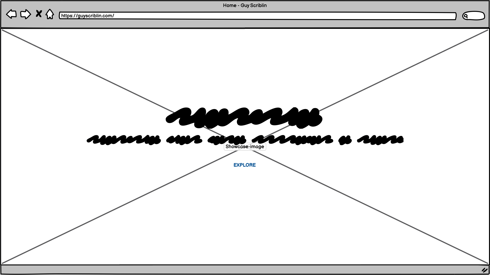
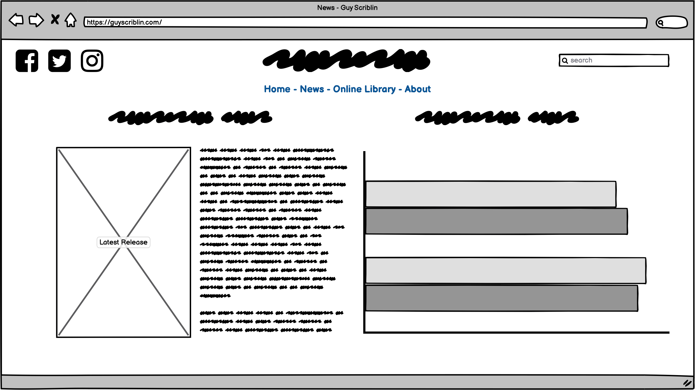
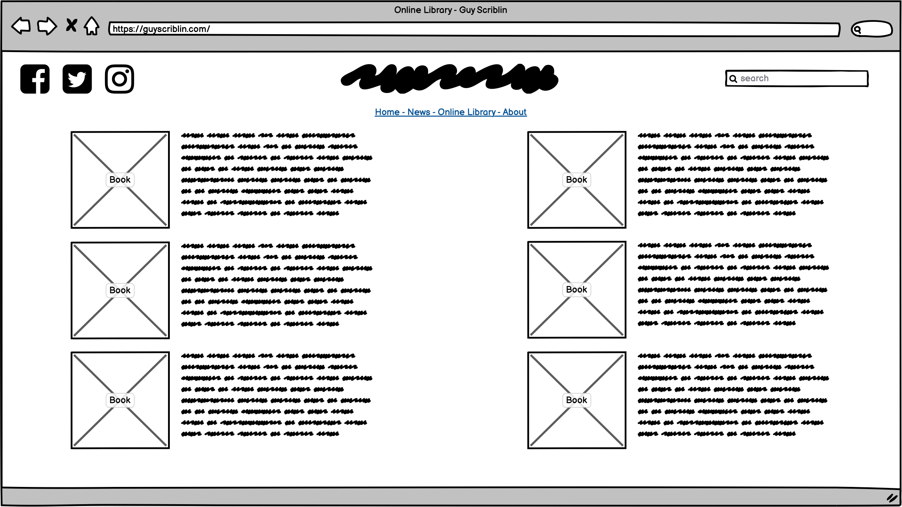
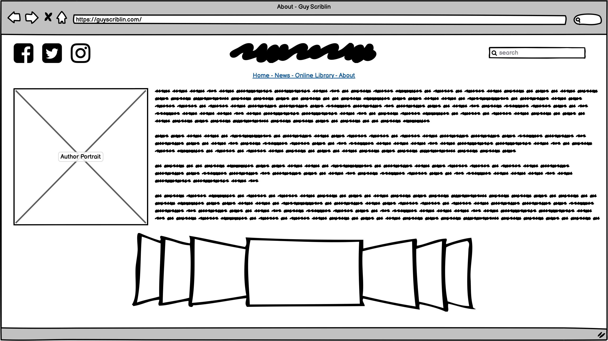

## Functionality

### Non-technical

The initial page - or landing page - you will see when visiting the website is little more than a decorated greeting for the user. Containing a title, which is the
author's name, and a subtitle inviting you to explore the website. The background image serves as the backdrop for all pages throughout the site.

At the top of the page is the navbar, which can be found on all pages throughout the website, and remains fixed to the top even when scrolling downwards. It contains six links: one logo -
which is the author's name - that will return you to the landing page if clicked. The first of the four navlinks - Home - shares the same function. The other three navlinks;
News, Online Library, and About, will direct you to the various pages that make up the rest of the website. The final element in the navbar is a button on the right-hand side
labelled "Sign up to the newsletter". When clicked it will open a small, floating window which will request your email address and a password for security purposes.

When visiting the News page you will see two main features. The first a series of progress bars that indicate what projects the author is working on and how close he is to
completing them. The second shows the book cover and synopsis of the author's most recently published novel.

If you click on the Online Library navlink, you can peruse the author's published works. Both book covers and synopses can be viewed and read.

Clicking the final navlink - About - will take you to the author biography page. Here you can view a portrait of the author and read about his life so far.

This is essentially all the functionality available on this site, which you can leaf through on any device. Despite its simple nature, I hope you enjoy browsing it for yourself.

### Technical

This project was written in HTML5 and CSS3. The Bootstrap framework was used for its helpful grid system and the responsive design features it provides. Bootstrap also provided 
the site's only JavaScript feature: which collapses all navlinks into a dropdown button for smaller device sizes. Where they would otherwise clutter the top of the screen.

Although Bootstrap is very useful, original CSS was also written to distinguish the site from a typical website created with the framework. Aspects such as the imagery, font, 
and colour scheme serve this purpose.

At first, the "Sign up to the newsletter" nav element was a simple link. However it was later changed to a button, which opens a modal when clicked. The modal contains a form
which requests the user's email address and password. There is as of yet no backend functionality supporting this sign-up feature.

The contents of the individual pages are organised in rows and columns and contain a small variety of features. Mostly images alonside original text. But also a section on the 
News page containing progress bars. The code for which was taken directly from the Bootstrap documentation, and tweaked somewhat to fit the site's aesthetic.

Finally, at the bottom of all the site's pages there is a simple footer which bookends the design of the website along with the fixed navbar at the top.

## Installation Instructions

To clone this project into Gitpod you will need:
1. A Github account. [Create a Github account here](https://github.com/)
2. Use the Chrome browser 

Then follow these steps:
1. Go to [my GitHub profile](https://github.com/pablo1793)
2. Click "Repositories" and choose the repo named "<strong>mp1-author_website</strong>"
3. Click the dropdown labelled "<strong>Code</strong>"
4. To clone the repository using HTTPS, under "Clone with HTTPS", copy the URL link
5. Open terminal
6. Change the current working directory to the location where you want the cloned directory
7. Type "<em>git clone</em>", and then paste the URL you copied earlier
8. Press <strong>Enter</strong> to create your local clone

## Testing + Bugfixes

### HTML Testing

Using the W3C Markup Validator:

* <strong>Landing page</strong> first check reveals an error in the navbar code. A div closing tag is missing. After fixing and upon second validation, <em>no errors or warnings to show</em>.
* <strong>News page</strong> first check reveals same navbar error and a misplaced paragraph closing tag. Fixed navbar issue on all remaining HTML files, and moved closing paragraph tag. Upon 
second validation the paragraph error persists. Next, I removed the paragraph tags completely so the text simply sits within its parent div. Upon third validation, <em>no errors 
or warnings to show</em>.
* Before validating <strong>Library page</strong> I removed the paragraph tags from the rest of texts throughout the website. Upon first validation of the Library page, there are <em>no errors or warnings to show</em>.
* Upon first validation of the <strong>About page</strong>, there are <em>no errors or warnings to show</em>.

### CSS Testing

Using the W3C CSS Validator:

* Upon first validation, <em>multiple parse errors</em> are announced. I think perhaps the comments I was using in my CSS file might be causing this, so I remove all comments.
* Upon second validation, the same problems persist; <em>many parse errors and warnings</em>. However, they all seem to be related to the Bootstrap URI, as I can't see any errors in the CSS that I've written. 
* After some time researching on Google and the Bootstrap documentation, I haven't been able to figure out exactly what the problem is. But it seems solely focused on the CDN URI. So there aren't any changes needed in my CSS, to the best of my knowledge.
* To make sure my CSS was satisfactory, I validated it via <em>direct input</em> and found there to be <em>no errors or warnings to show</em>.

### web.dev Testing

#### Audit results screencaps:

##### Landing Page

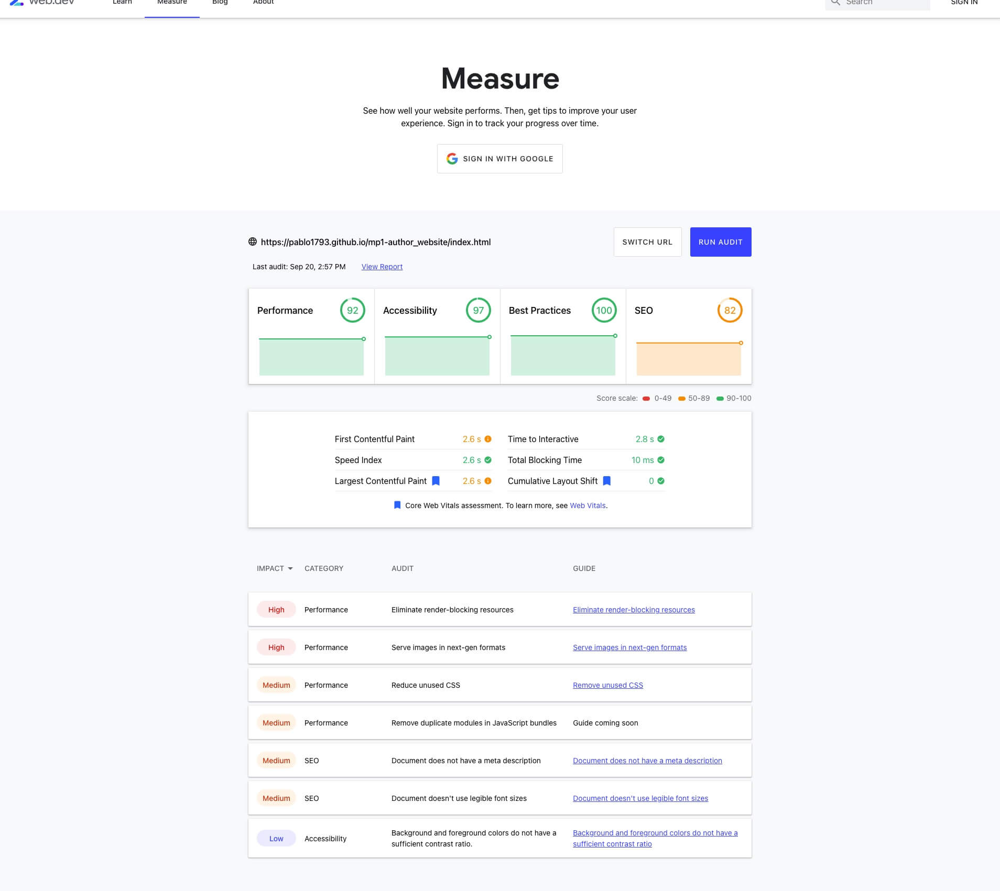

##### News Page

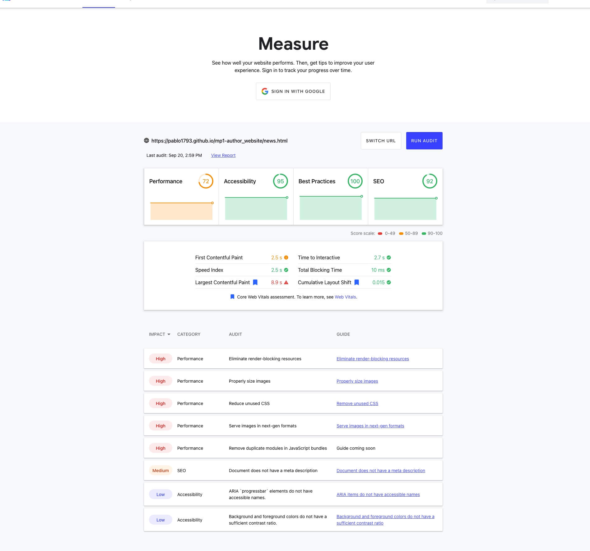

##### Library Page

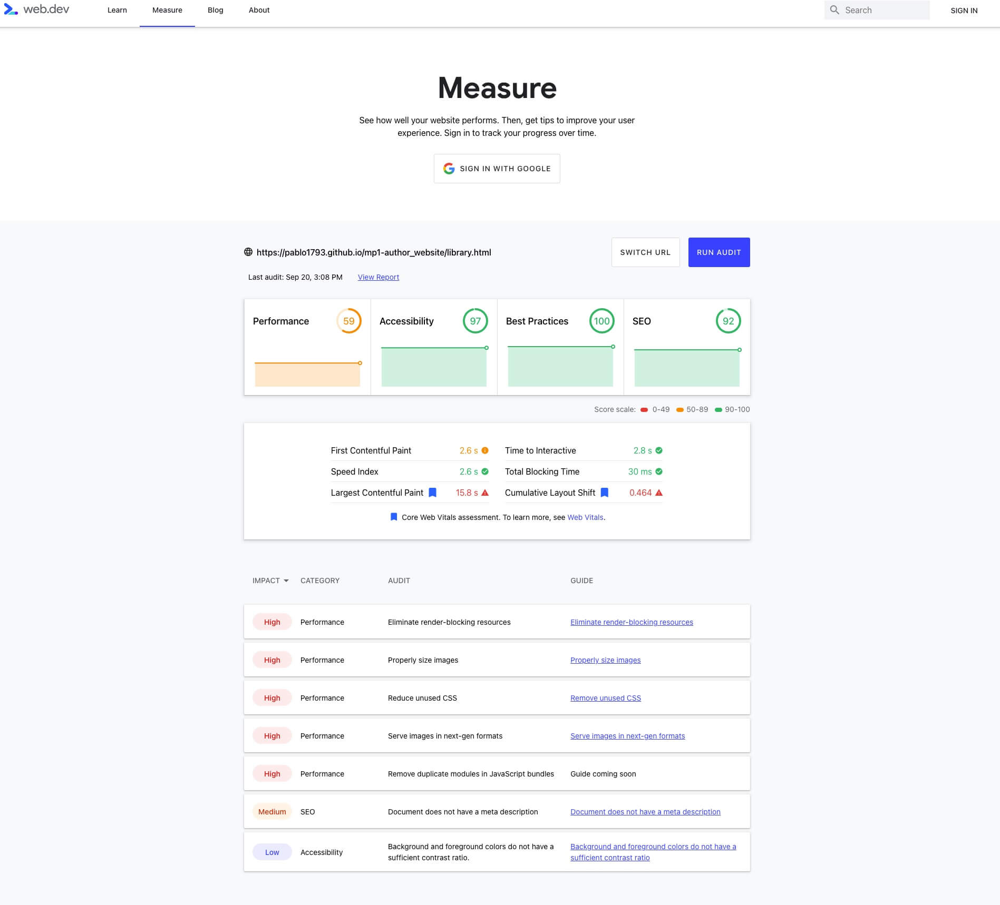

##### About Page

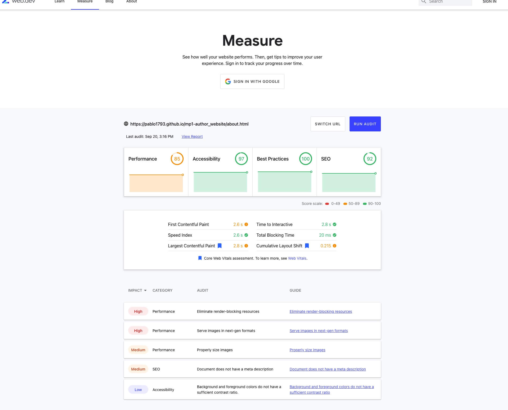

#### Audit conclusions:

1. The main issue hindering <strong>Performance</strong> on all pages are render-blocking resources. After some research I have concluded that these resources are in large part CSS and JavaScript components in the Bootstrap library which aren't being used but loaded along with those that are nonetheless when the website is used. As I don't have time to tailor these external libraries myself, for now I have to accept the somewhat hindered Performance.
2. Image sizes also seems to be affecting <strong>Performance</strong>. Observing this I researched which format would work best for this website, and concluded that minified JPEG images would work best. Providing satisfactory image quality, along with the smallest image sizes at my disposal to avoid unnecessary data usage. So I changed all images to that format and ran them through a minifying service before adding them back into the project.
3. Noticing the problems affecting <strong>Search Engine Optimization (SEO)</strong>: lacking meta descriptions and inappropriate font sizes on smaller devices. I promptly added meta descriptions to all pages. And afterwards did a significant restructuring of my websites code to control responsiveness more effectively. After rewriting my HTML to make it more semantically friendly, and reorganizing Bootstrap classes in my HTML, I proceeded to control font sizes and a few other properties on smaller devices via the use of a media query.
4. Further <strong>Performance</strong> issues: "Reduce unused CSS" and "Remove duplicate modules in JavaScript bundles". After going over my style.css file, I didn't find any superfluous - or unused - CSS. So I'm forced to conclude that these issues, like item 1 on this list, pertain to the external Bootstrap and JavaScript libraries I'm using. And as specified before, any editing of those libraries is out of my hands at present.
5. Finally, there is a slight contrast issue affecting <strong>Accesibility</strong>. However its impact is Low. And I am happy with the wesites current design and have decided to not alter the color palette.

## Final note on bugfixes

After implementing the changes described in item 3 of the previous Audit conclusions list, another problem was solved. During most of the process of writing the code for this project, I observed an <strong>unintentional spacing</strong> on the right side of all pages. It was most noticeable on smaller screen sizes, but present on every viewport. It can be viewed in the screen capture below this final note.

After combing through the code line by line using Chrome Developer Tools, I wasn't certain what was causing the problem, but I was quite sure it was a sizing issue. Generated by my untidy Bootstrap and simplistic HTML. So I proceeded to fix these discrepancies and - as previously mentioned - use a media query to ensure more reliable responsiveness on smaller devices.

To my elation, this general "tidying up" also solved the spacing

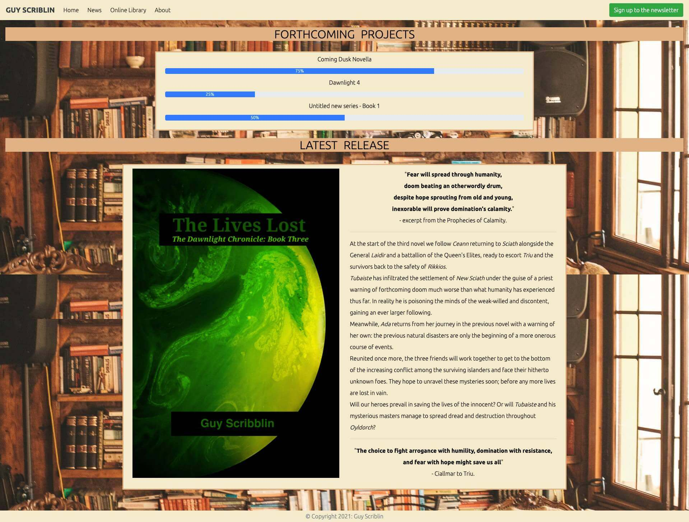

## Screenshots

The following are a series of screenshots of the website's final design. Although the background image appears choppy in the screen captures, this is due to the extension used to
take the screenshots. When using the website, the background image is set to fixed and no-repeat.

### Landing Page

### Modal

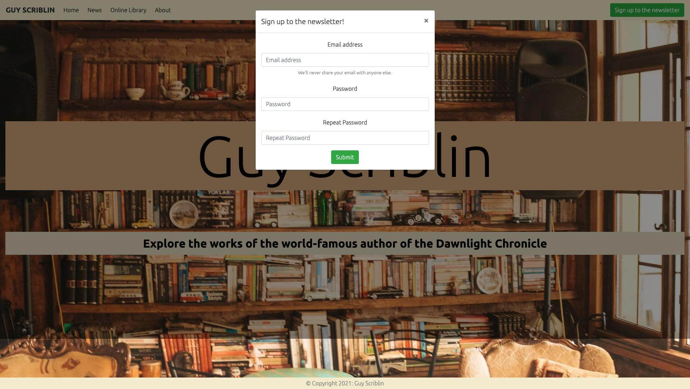

### News Page

### Online Library Page

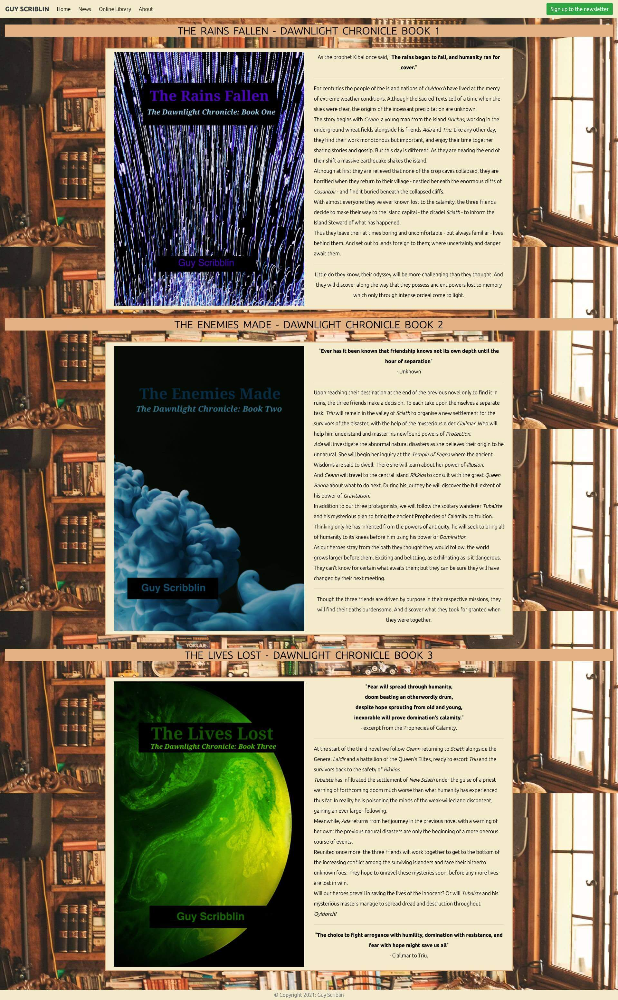

### About Page

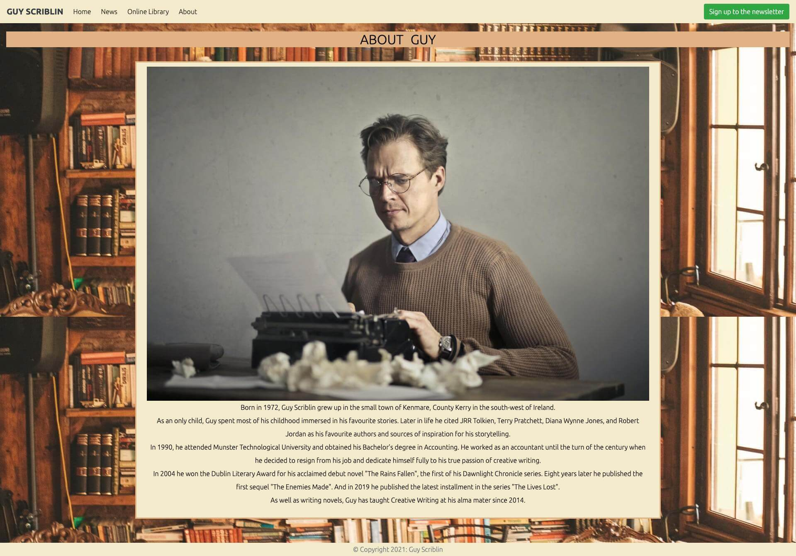

