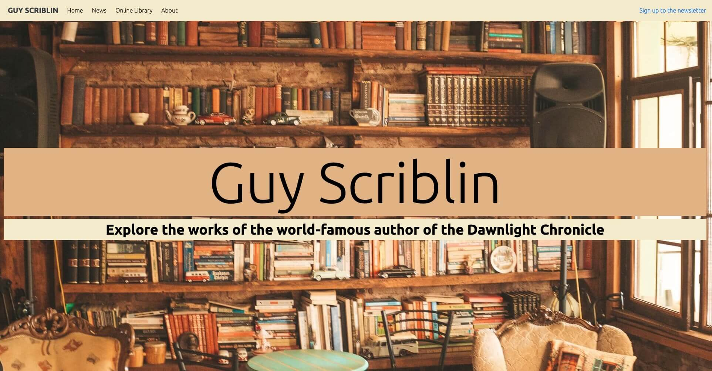

# Milestone Project 1 - Author Website

[View the live project here](https://pablo1793.github.io/mp1-author_website/)

This is my first webpage, created for my User Centric Frontend Development Milestone Project submission. It is a website for a fictional author named Guy Scriblin. It is designed to be responsive and accesible on a range of devices, making it easy to navigate for existing and potential readers alike.

# Technologies Used

## Languages Used

- HTML5
- CSS3

## Frameworks, Libraries & Programs Used

1. Bootstrap 4.5.3:
      - Bootstrap was used to assist with the responsiveness and styling of the website.
2. Hover.css:
      - Hover.css was used on the navbar links to enlarge the font-size of said links when hovered over with the cursor.
3. Google Fonts:
      - Google Fonts were used to import the "Ubuntu" font into the style.css file which is used on all pages throughout the project.
4. jQuery:
      - jQuery came with Bootstrap to make the navbar responsive on mobile devices.
5. Git:
      - Git was used for version control by utilizing the Gitpod terminal to commit to Git and push to Github.
6. GitHub:
      - GitHub is used to store the project's code after being push from Git. It also serves as a platform to deploy, clone, and share the project.
7. Gimp 2.10:
      - Gimp was used to create the images of the fictional book covers used in the website.
8. Pexels
      - Pexels was used to source the author portrait for the About page and the background image that features throughout.
9. Balsamiq:
      - Balsamiq was used before the beginning to code to create wireframes which served as reference for the design of the website.

